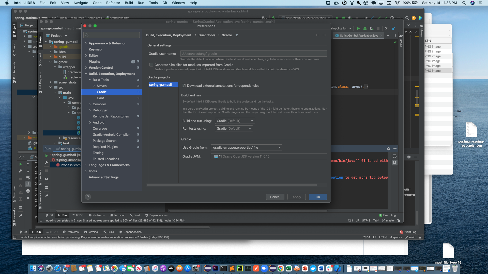
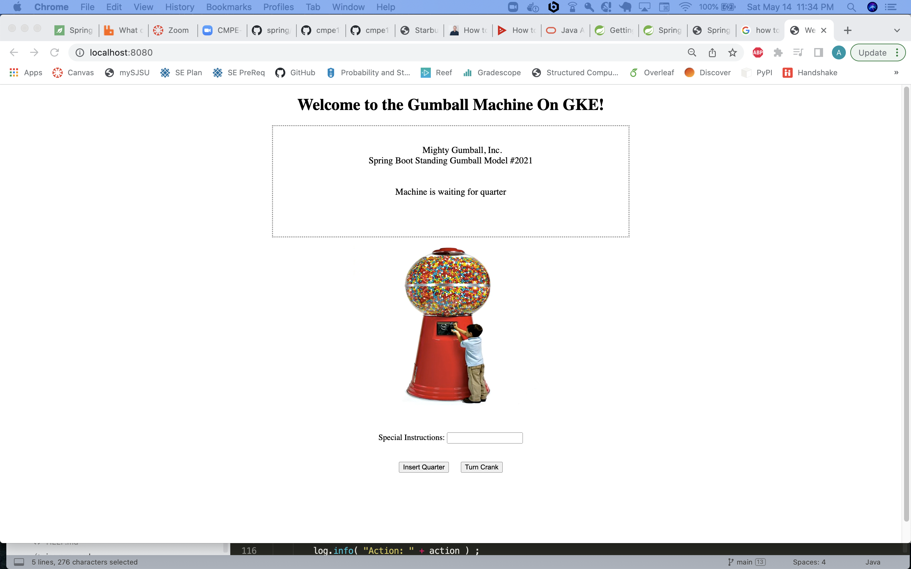
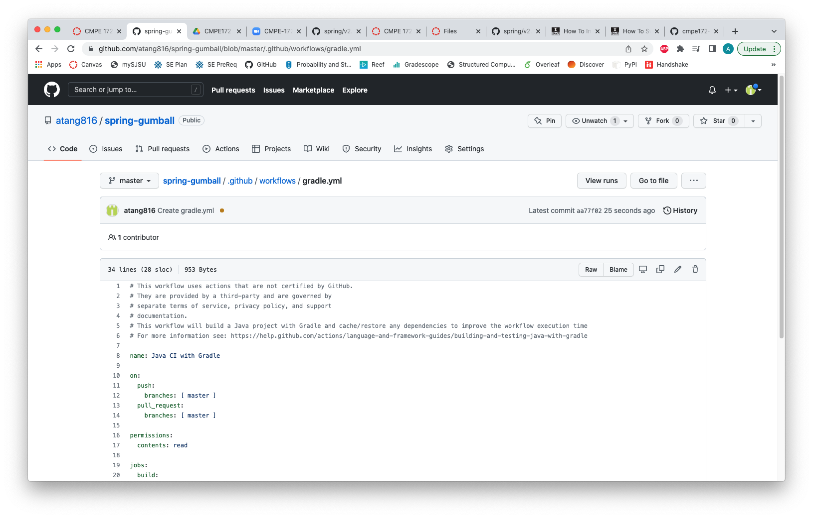
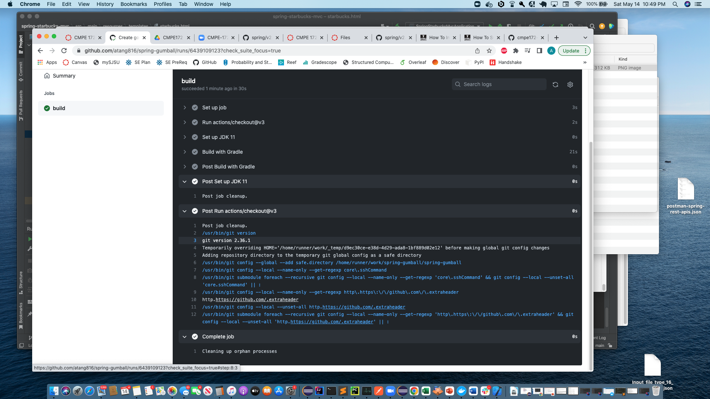
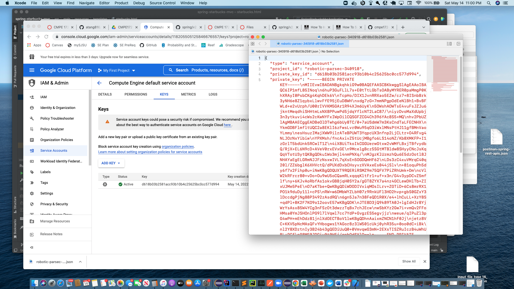
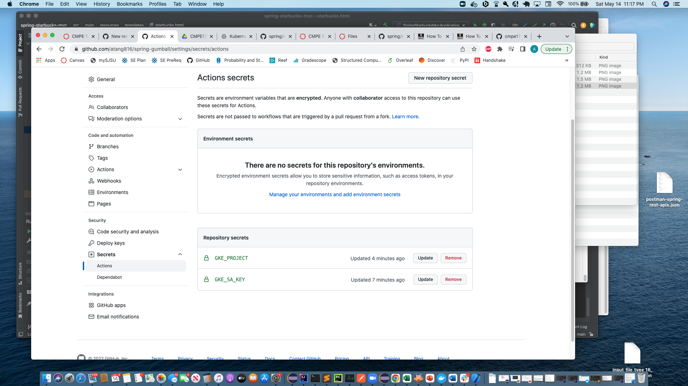
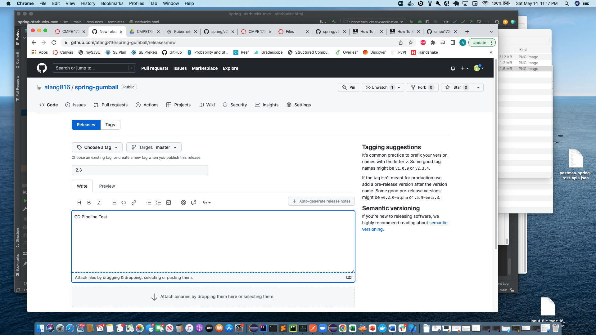
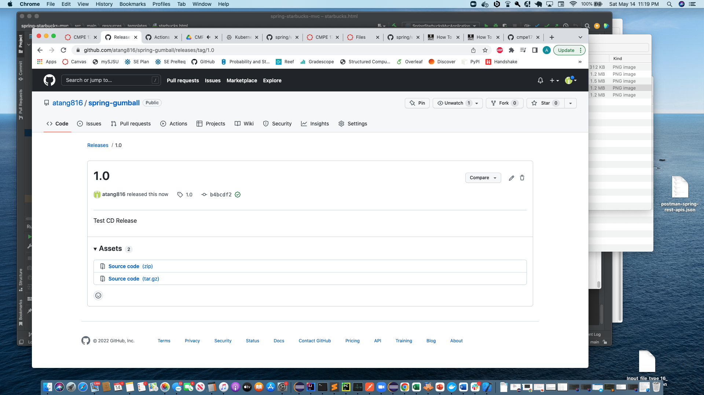

1. Had Problems running on gradle
2. Had to configure gradle JVM to Java 11

3. Ran Gumball Locally

4. Created CI Workflow

5. Build Success

6. Generated Key

7. Created GKE Secrets

8. Release Made

9. Publish Release

- I ran into a problem where the CD workflow was not executing after I published a release. I suspect it has something to do with GKE_PROJECT and GKE_SA_KEY secrets content I added.
- I tried referencing https://github.com/google-github-actions/setup-gcloud/blob/main/example-workflows/gke/README.md for help but no luck on getting the workflow to execute.
